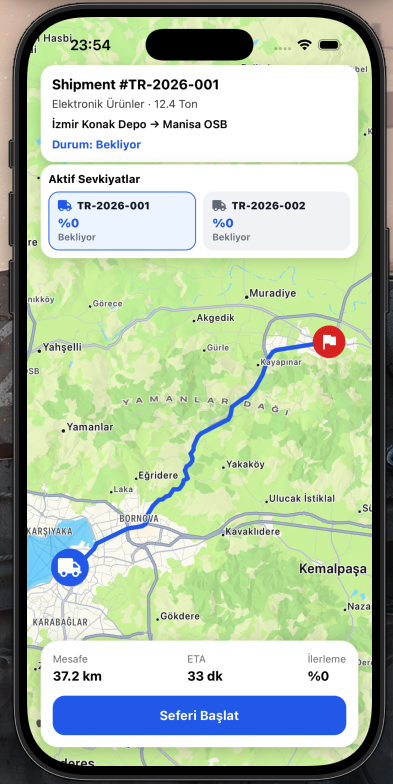
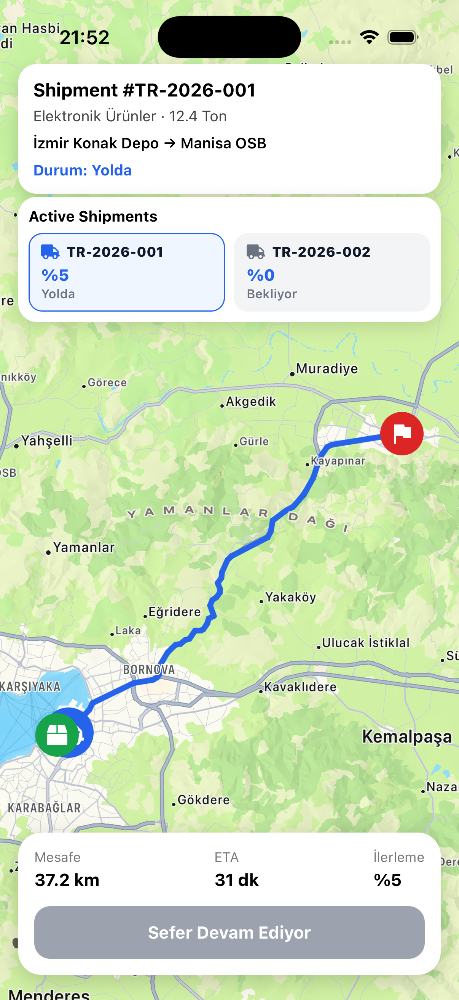
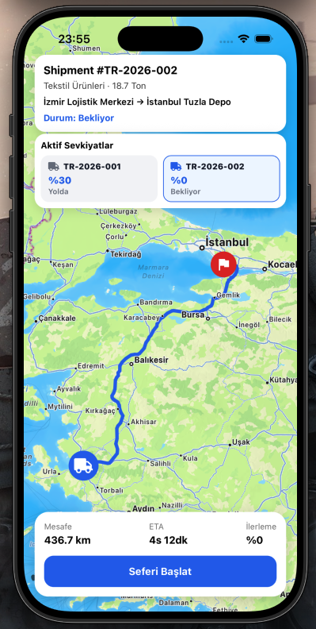
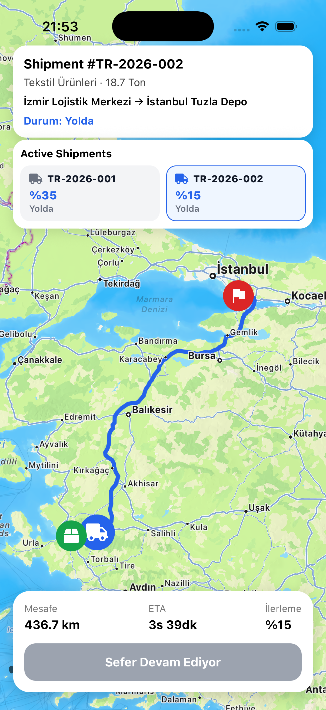
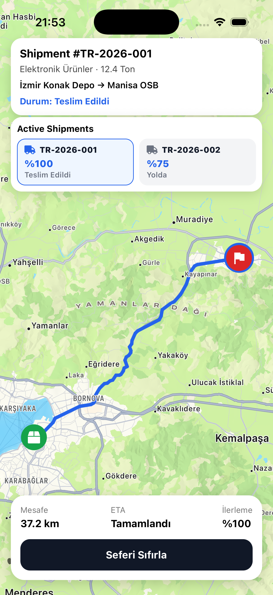
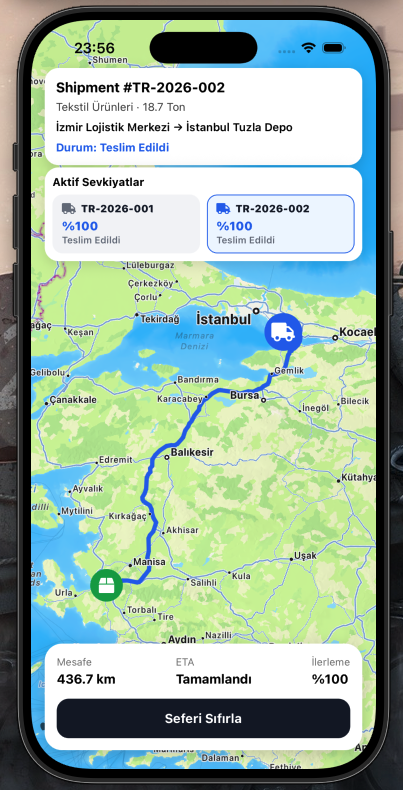

# QTech Logistics Tracking App

A lightweight logistics tracking application built with React Native and Expo.

The application demonstrates shipment tracking, route visualization, fleet monitoring, and real-time location updates on an interactive map.

---

## Features

### Shipment Tracking

- Track shipments between pickup and delivery locations
- Live truck movement simulation
- Shipment progress tracking
- ETA calculation
- Distance information

### Route Visualization

- Real road routes using OSRM Routing API
- Interactive map powered by React Native Maps
- Pickup, delivery, and truck markers
- Automatic route fitting and zooming

### Fleet Management

- Multiple active shipments
- Shipment switching
- Independent tracking state per shipment
- Fleet overview dashboard

### Tracking Simulation

- Periodic shipment updates
- Route-based truck movement
- Progress percentage updates
- Shipment status lifecycle

---

## Shipment Statuses

| Status     | Description                               |
| ---------- | ----------------------------------------- |
| Waiting    | Shipment is ready but has not started yet |
| In Transit | Shipment is currently moving              |
| Delivered  | Shipment successfully reached destination |

---

## Technical Decisions

### Route Service

Route generation is handled through the public OSRM Routing API.

Benefits:

- No API key required
- Real road geometry
- Distance and duration calculations
- Lightweight integration

If the routing service is unavailable, the application falls back to a direct line between the pickup and delivery locations, allowing the tracking flow to remain functional.

### Tracking Service

Since no backend service was provided, shipment tracking is simulated through a dedicated tracking service.

The architecture was intentionally designed to allow future integration with:

- REST APIs (Polling)
- WebSockets
- Server-Sent Events (SSE)

without major UI changes.

### State Management

The application uses React state because the project scope is limited.

For larger-scale implementations, state management solutions such as:

- Redux Toolkit
- Zustand

could be introduced.

---

## Project Structure

```text
src
├── components
│   ├── FleetOverview.tsx
│   ├── ShipmentHeaderCard.tsx
│   ├── ShipmentMap.tsx
│   └── ShipmentStatusCard.tsx
│
├── constants
│   └── shipments.ts
│
├── services
│   ├── routeService.ts
│   └── trackingService.ts
│
├── types
│   └── logistics.ts
│
└── utils
    └── formatDuration.ts
```

---

## Requirements

- Node.js 20+
- npm
- Expo Go or an iOS/Android simulator

---

## Installation

```bash
npm install
```

Start the development server:

```bash
npx expo start
```

Run on iOS:

```bash
i
```

Run on Android:

```bash
a
```

---

## Future Improvements

- Backend integration
- WebSocket-based tracking
- Driver authentication
- Push notifications
- Route recalculation
- Fleet statistics dashboard
- Offline support

---

## Tech Stack

- React Native
- Expo
- TypeScript
- React Native Maps
- Expo Vector Icons
- OSRM Routing API

---

## Screenshots








---

## Author

Developed as a React Native technical assessment project for QTech.

Erinç GÜNGÖR
Mobile App Developer
